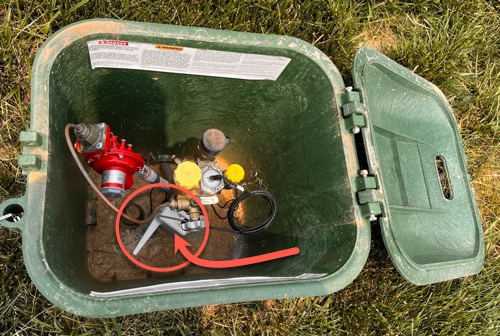
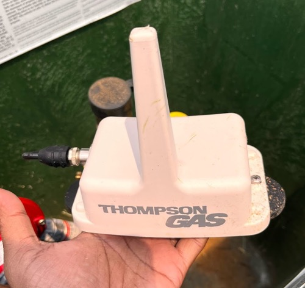
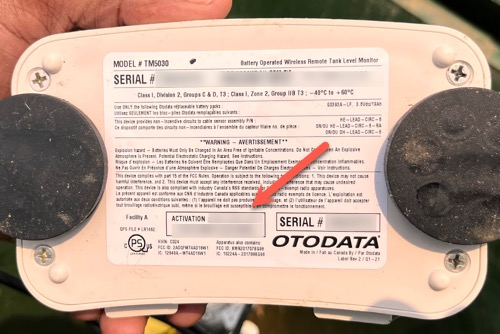
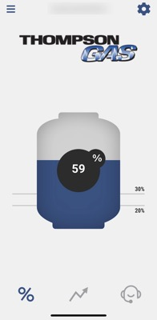

# propane-usage-stats
Communicates to a Otodata device used by Thompson Gas to pull the tank stats

# How-To / How does this work?
If you examine your wireless transponder device (usually found in the green dome where your propane tank is either buried or located. Looks like a submarine hatch), it will have an transponder that is manufactured by Otodata (it may have Thompson Gas logo or other logos on the device). Once you have identified it as a Otodata device and you have the activation code, you can download the "Nee-vo" app (available for both Android and iOS devices). You will create a new account with a userid and password. As the next step, you will be asked to enter the "Acivation Code". This registers the devices under your account. Once you get the stats showing in the app, you can then proceed to using this API example provided here in this project.

<table>
<tr>
<td></td>
<td></td>
</tr>
<tr>
<td></td>
<td></td>
</tr>
</table>

This project assumes that you have successfully registered your device and you can see the stats in the app. You will need your userid and password to access the API.

# Pre-requisites
1. Ensure that you have Python3 or greater installed.
2. Ensure that you habe "pipenv" installed. Instructions [here](https://pipenv.pypa.io/en/latest/installation/)
3. Install the required dependencies:
  - Requests : http client library
  - rfc3339 & tzlocal : timezone date format
4. Optionally use a bash shell and the ready-to-run shell script runs under bash (or you can adapt them for your favorite shell such as "Command-Prompt" or "Powershell" under Windows).

# Installation Instructions

*IMPORTANT*: 
If you are not from EST (Eastern Standard Time) timezone, edit "collect_tank_statistics.py" and set the timezone variable correctly (line 19).

## First-Time Installation (one-time run)

In a bash prompt, run:
```
./1_first_time_config.sh
```

## Daily Run Script

### Test and verify that the script works under normal conditions:

In a bash prompt, run:
```
pipenv run ./collect_tank_statistics.py "USERID" "PWD"
```
This will output the latest data collected to the standard output. Example below:

Format: _timestamp, gallonsRemaining, percentRemaining_

```
2023-06-07T19:42:07-04:00,590,59
```

### After testing, you can append the data daily to the data file:

In a bash prompt, run:
```
pipenv run ./collect_tank_statistics.py "USERID" "PWD" >> ./data/daily-stats.csv
```

You daily-stats will be appended to the file under "data/daily-stats.csv". At this point, you can leverage your OS specific way to automate the job:

OSX:
- use Automator and invoke it via a recurring Calendar entry.
Windows:
- Bash script kicked off in an automated fashion using Windows Scheduler.
Linux:
- Set up a cron job.

# How to plot the numbers visually?

In a bash prompt, run:
```
./plot.sh
```

Example Output:
```
 83.00 ┤                                             ╭╮
 79.20 ┼╮                                            │╰─╮       ╭╮          ╭╮
 75.40 ┤│  ╭────────╮                                │  ╰╮      │╰─╮        │╰──╮
 71.60 ┤│  │        ╰──────────╮                     │   ╰╮     │  ╰╮       │   ╰─╮
 67.80 ┤│  │                   ╰───╮                 │    ╰╮    │   ╰╮      │     ╰───╮
 64.00 ┤│  │                       ╰───╮             │     │    │    ╰─╮    │         ╰──────╮
 60.20 ┤│  │                           ╰─────╮       │     │    │      ╰─╮  │                ╰─────────────
 56.40 ┤╰╮ │                                 ╰──╮    │     ╰──╮ │        ╰╮ │
 52.60 ┤ ╰╮│                                    ╰─╮  │        ╰╮│         ╰╮│
 48.80 ┤  ╰╯                                      ╰╮ │         ╰╯          ╰╯
 45.00 ┤                                           ╰─╯
                                               Percent Levels (in %)
```

If you run into any issues or you need some help, look me up on my blog link below. 

Visit my blog at [MyThinkPond.com](http://mythinkpond.com)

Cheers! 